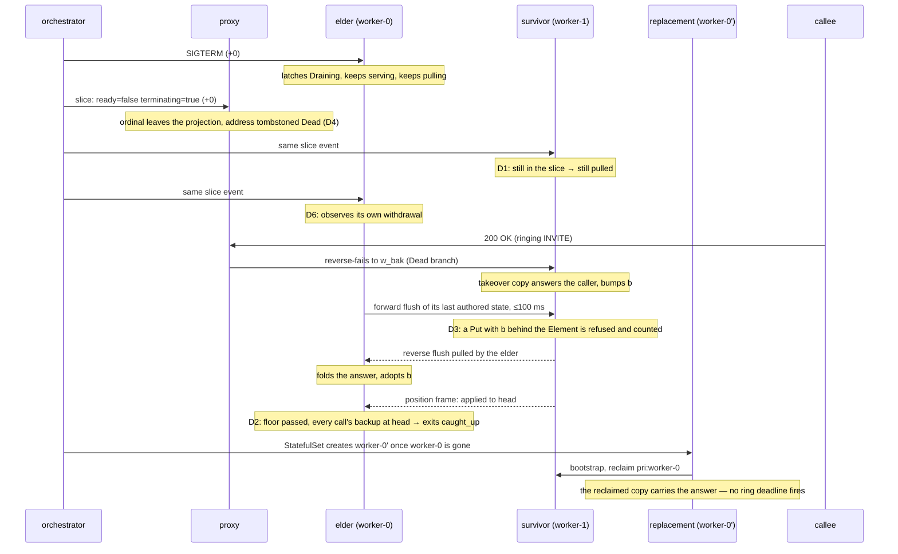
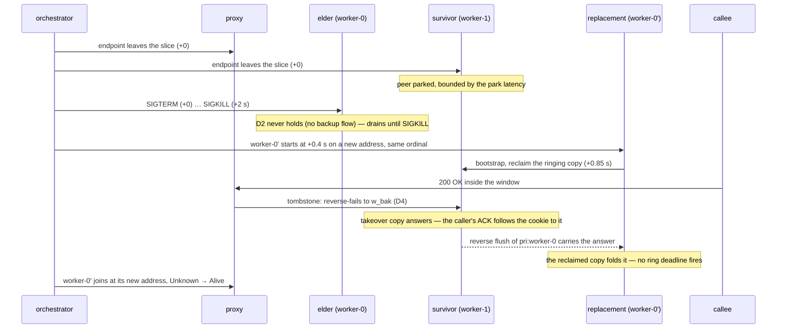
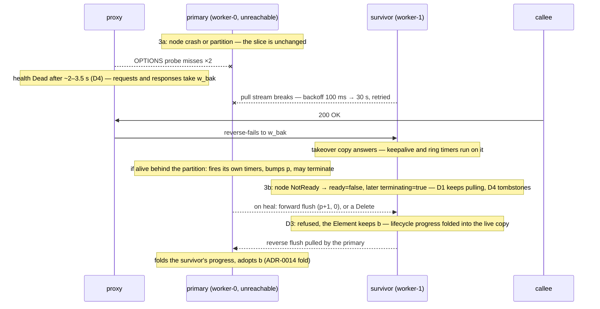

# 0031 — A worker's ways out: graceful, abrupt, vanished, restarted in place — one membership rule for a member still in the slice, one guard for the forward flush

**Status:** accepted (2026-09-13)

**Source:** this codebase. Triggered by the failover-harness scenario
`crates/failover-harness/tests/withdrawn_primary_answers_in_its_window.rs` and its views
ledger, which showed that the *graceful* exit — the most frequent one — opens the same
unreplicated window as a forced kill, for its whole drain grace. Amends ADR-0012 D4
(what membership deletion means) and ADR-0014 §3 (the forward apply rule) and §12 (the
removed `Ack` frame). The proxy's departed-address tombstone
(`crates/sip-proxy/src/registry/tombstone.rs`) is the routing half this ADR builds on.

## Context

A worker leaves a cluster's service in four ways, and every HA mechanism in this codebase
was designed against only the second one. The endpoint conditions are those of the
EndpointSlice API (`ready`, `serving`, `terminating`; the last two GA since Kubernetes
1.26; an absent `serving` defers to `ready`, an absent `terminating` means false).

| | how the pod goes | what the slice shows | how long the process still runs | who replaces it |
|---|---|---|---|---|
| **1. Graceful** (rolling update, node drain, scale-down; the frequent case) | `delete` under the pod's `terminationGracePeriodSeconds` (30 s); SIGTERM at +0 | `ready=false, terminating=true` at +0 and the endpoint **stays in the slice** until the pod is gone; `serving` flips false a few seconds later, because the worker's own `/ready` answers 503 once it latches `Draining` | until it exits on its own (drain, ≤ `B2BUA_DRAIN_GRACE_MS` = 5 s) or SIGKILL at the grace | the same ordinal, **after** the old pod is gone (a StatefulSet never runs two pods of one ordinal) |
| **2. Abrupt** (`delete --force --grace-period=0`) | the API object is removed at +0; kubelet still sends SIGTERM and SIGKILLs 2 s later | the endpoint **leaves the slice** at +0 (one `terminating=true` event may precede the removal) | 2 s | the same ordinal at a **new address** from +0.4 s, overlapping the old process |
| **3. Vanished** (node crash, network partition) | 3a, the first ~40 s: nothing, the pod object is untouched. 3b: the node controller marks the node NotReady, its pods `Ready=False`; taint eviction (~5 min) stamps a deletion timestamp; with the kubelet unreachable the pod can stay `Terminating` indefinitely | 3a: **unchanged**, `ready=true`. 3b: `ready=false, serving=false`, then `terminating=true`, still in the slice | unknown: dead, or alive behind a partition and still firing its timers | nobody for minutes; on a heal, the **same process** is back |
| **4. Restarted in place** (OOM-kill, kubelet restart, a readiness flap under load) | the pod object stays; the container restarts, or only the probe fails | `ready=false, serving=false, terminating=false`, still in the slice, **same address** | 0 (container restart) or the whole time (readiness flap: the process is alive and serving) | the same container, same address, seconds later |

What each element believed about the leaving worker, per case, from the harness's views
ledger and the production logs:

- **The proxy** learns of cases 1, 2 and 4 from membership (the ordinal leaves the
  projection when `ready` drops) and of case 3a from its OPTIONS probe only (`Dead` after two
  missed windows, ~2–3.5 s). Its request path fails an absent or `Dead` primary over to the
  cookie's `w_bak`; its response path does so for an INVITE response from a `Dead` worker
  and, since the tombstone, from a departed address.
- **The peers** learn of cases 1, 2 and 4 from membership and **park** the ordinal: pullers
  cancelled, watermark kept. The informer today emits only `ready` endpoints, so leaving the
  routable set and leaving the membership set are one event. Replication is pull-only, so
  from that instant nothing the worker authors reaches anyone. In case 3a they keep the
  peer, lose the TCP stream, back off (100 ms → 30 s) and retry.
- **The leaving worker itself** learns nothing from membership: a node filters its own
  ordinal out of its desired peer set and never observes its own withdrawal. SIGTERM is the
  only signal it has. On SIGTERM it latches `Draining` (OPTIONS 503, `/ready` 503), keeps
  serving, and waits for its live calls to clear or the grace to elapse. It keeps pulling
  its peers throughout, so it still folds their progress on its own calls.

The drain was designed as "keep serving in-flight transactions and have the time to flush
the call context to the backup". The second half never happened: the peers park the worker
the instant its endpoint drops, which in case 1 is the same instant SIGTERM arrives. The
drain then serves for 5 s into a void — and, since the tombstone routes everything around a
withdrawn address, it does not even receive the traffic it was kept alive for. Whatever it
authors in those seconds (a relayed 2xx, a cancelled ring timer, a terminal state) exists on
one node only. At the route-time ring deadline the reclaimed copy on the replacement, or the
takeover copy on the survivor, authors a second final onto an INVITE the caller already
ACKed (RFC 3261 §17.2.1, §13.3.1.4). The scenario reproduces this identically for the
graceful and the abrupt case. Case 4's readiness flap is the same defect without a
restart: a live, serving worker is parked by its peers for the length of the flap.

Case 3 has the mirror hazard. A partitioned primary keeps its calls, fires its own timers
and bumps `p` on them. When the partition heals, its **forward** flush of the `bak:`
partition is applied by the survivor unless the stored Element strictly dominates it — and
`(p+1, 0)` is never dominated by `(p, 1)`; a forward `Delete` is applied unconditionally.
The survivor's Element regresses to the primary's view, or is wiped, while its live takeover
copy is untouched; if the survivor later self-releases and re-takes over, it materialises
the regressed Element and fires a ring timer on a call it answered itself, or finds nothing
to materialise. Today the park in cases 1, 2 and 4 hides the same hazard; keeping the peers
pulling a draining worker would expose it.

## Decision

Six rules, each stated with the case it serves and the cases it must not harm. The ADR
assumes at least two workers; with one, D1 and D2 have no peer and degrade to today's
quiescence-or-grace.

**D1 — A member still in the slice stays a replication peer; only a `ready` member is a
routing target.** The informer emits every endpoint in the slice as a `Peer` carrying
`ready` and `terminating`; a condition flip is a delta, never a host move: a `terminating`
flip on a ready member must not reset the proxy's health or re-arm its fresh-pod guard, while a
`ready` flip departs the member at the proxy and a return rejoins it as a fresh endpoint. *Pullable* is "present in the slice", whatever its
conditions: the supervisor pulls it like a ready peer until it leaves the slice. *Routable*
is `ready`: the proxy's `WorkerSet::recompose` filters the snapshot at the projection, so a
`ready=false` member departs exactly as today — the ordinal leaves the projection and its
address is tombstoned — and the response-path failover is unchanged. Pullable is keyed
on presence, not on `serving`: the draining worker's own `/ready` 503 drives
`serving=false` within seconds of SIGTERM, long before its drain ends.
Serves case 1 (the peers ingest what the draining worker authors within one 100 ms poll
tick) and case 4 (a readiness flap no longer parks replication). Case 2 presents at most one
`terminating` event before the removal: harmless. Case 3b keeps pulling a member that is
unreachable, and may do so indefinitely for a pod stuck `Terminating`: the same backoff as
3a today, and D3 guards the heal. A member that is only pullable is not a backup target: a
`w_bak` cookie minted on it resolves to nothing until the replacement joins, as today; in a
two-worker cluster the survivor's calls have no failover for that window (the fresh-pod
guard covers the replacement's first seconds). (Amends ADR-0012 D4: membership deletion no
longer means "gone" for both consumers at once.)

**D2 — The drain of a withdrawn worker exits when its backups hold its calls.** Three
preconditions, all required: (i) the worker has observed its own withdrawal (D6), so
nothing new can be routed to it; (ii) a floor, `B2BUA_DRAIN_MIN_MS` (default 1000 ms), has
elapsed since SIGTERM, so an INVITE the proxy routed before the slice update is still
served; (iii) for **every live call** this worker serves, the Backup flow from the peer the
call names as its backup (`topology.bak`) is connected and has **applied** this worker's
changelog head. "Applied" is reported by the puller in a new position frame (the drain's
own signal, never a takeover or readiness gate — the role ADR-0014 §12 retired `Ack`
from). A call whose backup flow is absent or behind keeps the
drain waiting; the grace (5 s) stays the ceiling and live calls clearing stays an exit. The
exit reason is counted (`quiescent`, `caught_up`, `grace_peers_behind`): the last one is
"a flush window was lost" and must be visible. A worker that is not withdrawn (direct-bound,
static membership, or SIGTERM before the slice moved) keeps quiescence-or-grace: takeover is
reactive, so a proxied worker's calls are served on the next in-dialog request, but a
direct-bound worker's would be abandoned. Exiting on `caught_up` with live calls is a
*replicated crash*, deliberately: ringing calls wait for the caller's next request or its
own timers, as after any crash. Serves case 1. Case 2 runs the same drain for its 2 s: the
peers have parked, (iii) never holds, SIGKILL ends it. Cases 3 and 4 run no drain.

**D3 — A forward flush never regresses backup progress.** This rule changes the
**Forward** direction only — the Backup flow after bootstrap — and therefore requires the
puller's `ForwardOrBootstrap` mode to split into `Forward` and `Bootstrap`; bootstrap keeps
ADR-0014 §3's "take the replica's `(p,b)` as-is". In Forward: a `Put` `(p', b')` is refused
when the stored Element carries `b > b'`; a `Delete` is refused when the Element carries
`b > 0` and its body is not terminal (delete-wins stays for everything else). Both are
counted. A refused body is folded only where a live copy exists: if this node holds a live
takeover copy of the call, the body is handed to the live fold (unanswered < caller
answered < terminating < terminated, ADR-0014's rule); an Element alone is kept as it is,
its merge deferred to the next materialisation. After a refusal the vector is split
(`(p+k, 0)` against `(p, b)`) and only lifecycle progress crosses it in either direction;
when the primary folds the backup's reverse flush it **adopts the Element's `b`**, so its
next forward flush is accepted and the split heals. Serves case 3 (the heal) and case 1
under D1 (the draining worker's last flushes); in case 2 it is active for the park latency
only. Residual, unchanged from ADR-0014's dual-owner window: a partitioned primary that
terminated a call the survivor kept serving has already written its CDR; the survivor
writes its own. (Amends ADR-0014 §3.)

**D4 — Routing around a leaving worker has two signals, one branch.** Membership
(cases 1, 2 and 4: the address is tombstoned `Dead`) and the OPTIONS probe (case 3a: `Dead`
after the miss threshold) both land on the same `Dead` health, and the request and response
paths already take the backup on it. The response path takes the backup for
**INVITE responses only**: a non-INVITE response answers a client transaction
only its sender holds (RFC 3261 §17.1.2), so it follows the Via to its sender
whatever that sender's health. The tombstone is **re-armed by every response the
proxy sees from that address**, so it lives Timer H past the last sign of life, whatever
the drain grace is set to; a fixed TTL from departure would expire under a live elder
whose grace was raised. The proxy's `Draining` grace (in-dialog traffic sticks to a draining
primary for 5 s) is recorded as effectively unreachable under Kubernetes: a probe tick can
stamp it inside the withdrawal window, but the ordinal leaves the projection first in
practice. It stays for a static worker pool.

**D5 — The leaving worker keeps serving what still reaches it, and never stands down on
its own.** No "stop authoring on SIGTERM": a proxied worker receives nothing after
withdrawal, a direct-bound one must finish what it holds. What protects the caller from a
second, *different* final is the fold: the primary pulls the survivor's reverse flush and
inherits its obligations (D3 keeps the fold's inputs honest). A duplicate 2xx it re-emits
from the survivor's retained datagram is tag-identical and merely harmless. Convergence is
by folding, never by a primary going passive; the acting-backup self-release stays scoped
to takeover copies (ADR-0014). The SIGTERM-versus-informer race (tens of milliseconds
either way) is benign because of D1: an INVITE served in it is replicated.

**D6 — A worker observes its own endpoint.** The worker already runs the informer; one
predicate on its own `targetRef.name` tells it it is withdrawn (`terminating` and not
`ready`, or absent — a not-ready endpoint that is not terminating is a readiness flap).
On that signal it latches `Draining` even if SIGTERM is late (a preStop hook, a stuck
kubelet), and it is the precondition D2 needs to know that nothing new will arrive. A
worker on a static membership never observes itself and keeps today's behaviour. This
does not make the worker stand down (D5); it makes it know what the proxy knows.

## The cases after this decision

### Case 1 — graceful

Design change here: D1, D2, D3, D6. The other cases never satisfy D2's preconditions and
present D1 only as described below.

### Case 2 — abrupt

Design change here: none beyond the tombstone already landed. What the elder authors in its
2 s is lost, bounded by the tombstone to what it does on its own (timers), never to a
message the callee sent. Accepted residual; the harness's abrupt case pins that the caller
is answered once.

### Case 3 — vanished

Design change here: D3, and D1's presence rule in 3b. D2 and D6 never engage before the
eviction. The dual-owner window while the partition lasts is ADR-0014's accepted trade-off,
unchanged.

### Case 4 — restarted in place

No diagram: `ready` drops with the endpoint still in the slice at the same address. The
proxy departs it and tombstones the address; a join at the same address clears the
tombstone and the entry is `Unknown` until probed, as today. Under D1 the peers keep
pulling: a readiness flap pulls a live worker (the fix), a container restart pulls a fresh
incarnation once it listens again (the same reconnect as today's reboot).

## Why the frequent case does not tax the others

| mechanism | 1 graceful | 2 abrupt | 3 vanished | 4 in place |
|---|---|---|---|---|
| D1 pull every member in the slice | active | one event at most | 3b: keeps pulling an unreachable member | active |
| D2 caught-up drain exit | active | never holds: SIGKILL ends the drain | no drain | no drain |
| D3 forward-flush guard | active on the last flushes | active for the park latency | **active on the heal** | inert |
| D4 tombstone / probe `Dead` | tombstone, re-armed on sight | tombstone | probe, then tombstone in 3b | tombstone |
| D5 keep serving, never stand down | drain finishes what reaches it | 2 s into a void | timers only | unchanged |
| D6 self-observation | active | active (the endpoint is absent) | 3b only | inert (a flap is no withdrawal) |

D3 is the one rule every case shares, and it is a refusal, not a new flow. D2 is the one
rule that could cut a drain short, and its three preconditions make it inert wherever the
peers do not hold the calls.

## Consequences

- `topology::Peer` carries `ready` and `terminating`; `peers_from_slices` emits every
  endpoint in the slice; `SimulatedMembership` can set the flags, so the failover harness
  expresses case 1 as "withdraw from routing, keep the peers pulling", case 2 as "withdraw
  from both", and case 4 as "not ready, same address".
- The proxy's `WorkerSet::recompose` filters `ready` at the projection; departure and
  tombstoning are unchanged. The tombstone re-arms on every response seen from its address.
- The puller sends a position frame after applying a batch; `drain_until_quiescent` takes
  the D2 predicate, the floor and the withdrawal precondition; the exit reason is a counter,
  time-in-drain a histogram, pulled-not-ready peers a gauge, refused forward flushes a
  counter beside the reverse one.
- The reason set is four: a non-withdrawn worker reaching the ceiling is `grace`, distinct
  from a withdrawn one's `grace_peers_behind`.
- `ApplyMode::ForwardOrBootstrap` splits; the Forward mode refuses a backup regression on
  `Put` and on `Delete`; the primary's fold adopts `b`.
- The worker's supervisor evaluates its own endpoint (D6).
- Harness cases: terminating-but-pulled (1), the abrupt case unchanged (2), partition then
  heal with a Put and with a Delete (3), readiness flap without park (4), drain exits
  `caught_up` inside the grace, drain waits with a backup behind, forward refusal unit at
  the puller.
- CONTEXT.md gains **withdrawal**, **terminating member**, **departed-address tombstone**;
  the K8sMembership entry names the two predicates; the readiness entry names the drain's
  exits.
- Out of scope: a push-based flush (replication stays pull-only, ADR-0011); stopping a
  worker from authoring (D5).
