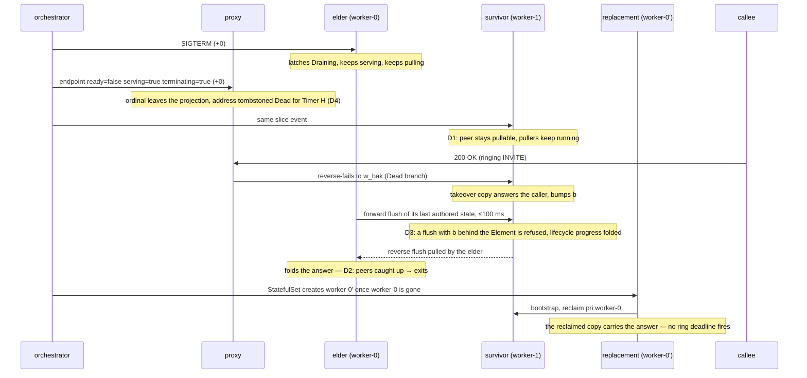
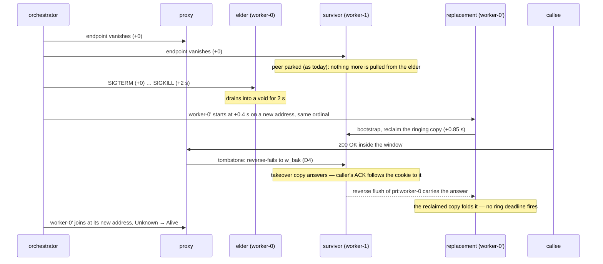
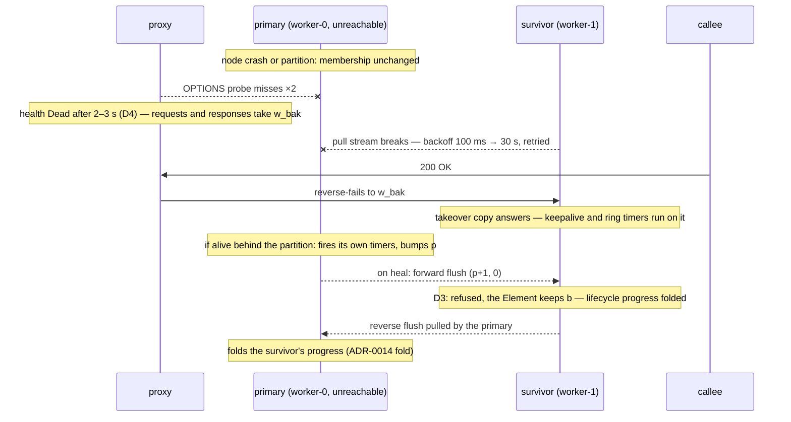

# 0031 — A worker's three ways out: graceful, abrupt, vanished — one membership rule for a terminating member, one guard for the forward flush

**Status:** proposed (2026-09-13)

**Source:** this codebase. Triggered by the failover-harness scenario
`crates/failover-harness/tests/withdrawn_primary_answers_in_its_window.rs` and its views
ledger, which showed that the *graceful* exit — the most frequent one — opens the same
unreplicated window as a forced kill, for its whole drain grace. Amends ADR-0012 D4
(what membership deletion means) and ADR-0014 (the forward apply rule). The proxy's
departed-address tombstone (`crates/sip-proxy/src/registry/tombstone.rs`) is the routing
half this ADR builds on.

## Context

A worker leaves a cluster in exactly three ways, and every HA mechanism in this codebase
was designed against only the second one.

| | how the pod goes | what the informer sees | how long the process still runs | who replaces it |
|---|---|---|---|---|
| **1. Graceful** (rolling restart, node drain, scale-down; the frequent case) | `delete` with the pod's `terminationGracePeriodSeconds` (30 s); SIGTERM at +0 | the endpoint flips `ready=false, serving=true, terminating=true` at +0 and stays in the slice until the pod is gone | until it exits on its own (drain, ≤ `B2BUA_DRAIN_GRACE_MS` = 5 s) or SIGKILL at the grace | the same ordinal, **after** the old pod is gone (a StatefulSet never runs two pods of one ordinal) |
| **2. Abrupt** (`delete --force --grace-period=0`, `kill -9`, OOM-kill) | the API object is removed at +0; kubelet still sends SIGTERM and SIGKILLs 2 s later | the endpoint **vanishes** at +0 — there is nothing to read | 2 s (force) or 0 (kill -9) | the same ordinal at a **new address** from +0.4 s, overlapping the old process; an OOM-kill restarts the container in place, same address |
| **3. Vanished** (node crash, network partition) | nothing: the pod object is untouched until the node controller marks the node NotReady (~40 s) and evicts (minutes) | **unchanged** — the endpoint stays `ready=true` | unknown: dead, or alive behind a partition and still firing its timers | nobody for minutes; on a heal, the **same process** is back |

What each element believed about the leaving worker, per case, from the harness's views
ledger and the production logs:

- **The proxy** learns of case 1 and 2 from membership at +0 (the ordinal leaves the
  projection) and of case 3 from its OPTIONS probe only (`Dead` after two missed windows,
  2–3 s). Its request path fails an absent or `Dead` primary over to the cookie's `w_bak`;
  its response path does so for `Dead`, and since the tombstone, for a departed address.
- **The peers** learn of case 1 and 2 from membership at +0 and **park** the departed
  ordinal: pullers cancelled, watermark kept. Replication is pull-only, so from that instant
  nothing the leaving worker authors reaches anyone. In case 3 they keep the peer, lose the
  TCP stream, back off and retry.
- **The leaving worker itself** learns nothing from membership: a node filters its own
  ordinal out of its desired peer set and never observes its own withdrawal. SIGTERM is the
  only signal it has. On SIGTERM it latches `Draining` (OPTIONS 503, `/ready` 503), keeps
  serving, and waits for its live calls to clear or the grace to elapse. It keeps pulling
  its peers throughout, so it still folds their progress on its own calls.

The drain was designed as "keep serving in-flight transactions and have the time to flush
the call context to the backup". The second half never happened: the peers park the worker
the instant its endpoint drops, which in case 1 is the same instant SIGTERM arrives. The
drain then serves for 5 s into a void — and, since the tombstone routes everything around a
withdrawn address, it does not even receive the traffic it was kept alive for. Whatever it
authors in those seconds (a relayed 2xx, a cancelled ring timer, a terminal state) exists on
one node only. At the route-time ring deadline the reclaimed copy on the replacement, or the
takeover copy on the survivor, authors a second final onto an INVITE the caller already
ACKed (RFC 3261 §17.2.1, §13.3.1.4). The scenario reproduces this identically for the
graceful and the abrupt case.

Case 3 has the mirror hazard. A partitioned primary keeps its calls, fires its own timers
and bumps `p` on them. When the partition heals, its **forward** flush of the `bak:`
partition is applied by the survivor unless the stored Element strictly dominates it — and
`(p+1, 0)` is never dominated by `(p, 1)`. The survivor's Element regresses to the primary's
view while its live takeover copy is untouched; if the survivor later self-releases and
re-takes over, it materialises the regressed Element and fires a ring timer on a call it
answered itself. Today the park in cases 1 and 2 hides the same hazard; keeping the peers
pulling a draining worker would expose it.

## Decision

Five rules, each stated with the case it serves and the cases it must not touch.

**D1 — A terminating member stays a replication peer and stops being a routing target.**
The informer exposes the endpoint's `terminating` condition on `Peer`. The replication
supervisor keeps pulling a `serving && terminating` peer exactly as a ready one, until the
endpoint disappears from the slice. The proxy registry treats `ready=false` as departure:
the ordinal leaves the projection and its address is tombstoned, as today. One snapshot,
two predicates: *pullable* is `serving`, *routable* is `ready`. Serves case 1 (the drain's
flush becomes real: the peers ingest what the draining worker authors within one 100 ms
poll tick). Cases 2 and 3 never present a `terminating` endpoint, so nothing changes for
them. (Amends ADR-0012 D4, where membership deletion meant "gone" for both consumers.)

**D2 — The drain exits when its peers have caught up.** `drain_until_quiescent` gains a
third exit: every peer flow that pulls this node has acknowledged the node's changelog
head. The replication server already knows each flow's position. The grace stays the
ceiling (5 s under a 30 s pod grace), live calls clearing stays an exit, and a node that
still has calls but whose peers hold every byte of them exits at once. Serves case 1
(a proxied worker never sees its calls clear, because the proxy has already moved them;
today it always burns the whole grace). Cases 2 and 3 never run a drain.

**D3 — A forward flush never regresses backup progress.** The forward apply rule becomes
symmetric with the reverse one: an incoming `(p', b')` is refused when the stored Element
carries `b > b'`, counted, and folded only when it carries lifecycle progress the Element
lacks (unanswered < caller answered < terminating < terminated, the ADR-0014 fold). Serves
case 3 (the heal) and case 1 under D1 (the draining worker's last flushes), and is inert
in case 2 (the old address flushes into a parked stream). (Amends ADR-0014: the `(p,b)`
vector stays the gate; the gate now refuses a backup regression on both directions.)

**D4 — Routing around a leaving worker has two signals, one branch.** Membership
(cases 1 and 2: the address is tombstoned `Dead` for Timer H) and the OPTIONS probe
(case 3: `Dead` after the miss threshold) both land on the same `Dead` health, and the
request and response paths already take the backup on it. No new routing rule; the ADR
records that the proxy's `Draining` grace (in-dialog traffic sticks to a draining primary
for 5 s) is unreachable under Kubernetes, because the ordinal leaves the projection before
the probe can report `Draining`. It stays for a static worker pool.

**D5 — The leaving worker keeps serving what still reaches it, and never stands down on
its own.** No "stop authoring on SIGTERM": a proxied worker receives nothing after
withdrawal, a direct-bound one must finish what it holds, and in both a duplicate 2xx
retransmission carries the same tag as the answer (the harness caller re-ACKs and forms no
second dialog). Convergence is by folding (the primary pulls the survivor's reverse flush
and inherits its obligations), guarded by D3, never by a primary going passive. The
acting-backup self-release stays scoped to takeover copies (ADR-0014).

## The three cases after this decision

### Case 1 — graceful

Design change here: D1, D2, D3. Cost: none for the other cases (they never present the
condition D1 keys on).

### Case 2 — abrupt

Design change here: none beyond the tombstone already landed. What the elder authors in its
2 s is lost, bounded by the tombstone to what it does on its own (timers), never to a
message the callee sent. Accepted residual; the harness's abrupt case pins that the caller
is answered once.

### Case 3 — vanished

Design change here: D3 only. D1 and D2 never engage: no `terminating` condition, no drain.
The dual-owner window while the partition lasts is ADR-0014's accepted trade-off, unchanged.

## Why the frequent case does not tax the other two

| mechanism | case 1 | case 2 | case 3 |
|---|---|---|---|
| D1 keep pulling a terminating peer | active | inert: no endpoint to read | inert: endpoint unchanged |
| D2 caught-up drain exit | active | inert: no drain | inert: no drain |
| D3 forward-flush guard | active on the last flushes | inert: stream parked | **active on the heal** |
| D4 tombstone / probe `Dead` | tombstone | tombstone | probe |
| D5 keep serving, never stand down | drain finishes what still reaches it | 2 s into a void | timers only |

D3 is the one rule that all three share, and it is a refusal, not a new flow: a flush the
stored Element already dominates on the backup counter is dropped and counted, exactly as
the reverse direction has done since ADR-0014.

## Consequences

- `topology::Peer` carries `terminating`; `SimulatedMembership` can set it, so the failover
  harness expresses case 1 as "withdraw from routing, keep the peers pulling" and case 2 as
  "withdraw from both", the two primitives it needs on top of `withdraw`/`readmit`.
- `drain_until_quiescent` takes a third predicate, "peers caught up", fed by the
  replication server's per-flow acknowledged watermark; `B2BUA_DRAIN_GRACE_MS` stays 5 s.
- The forward apply path in the puller gains the symmetric refusal and the lifecycle fold;
  `repl_forward_flush_refused_total` beside the reverse counter.
- The scenario file grows the third case (crash without withdrawal, probe-driven `Dead`)
  and the graceful case moves to D1 semantics; the views ledger is the oracle for "who
  believed what".
- CONTEXT.md gains **withdrawal**, **terminating member**, **departed-address tombstone**,
  and the readiness entry names the drain's three exits.
- Out of scope: a push-based flush (replication stays pull-only, ADR-0011), and a worker
  observing its own withdrawal (SIGTERM remains its only signal; D1 makes that sufficient).
