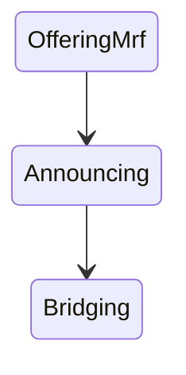

# State machine: `announcement`

<!-- GENERATED by `cargo run -p xtask -- state-machine-docs` from the composed
     service registry (ADR-0016). Do not edit by hand; regenerate instead. -->

```mermaid
stateDiagram-v2
    Announcing
    Bridging
    OfferingMrf
    Announcing --> Bridging
    OfferingMrf --> Announcing
```
